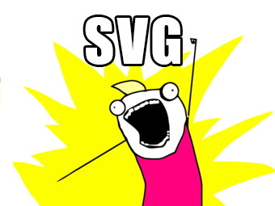
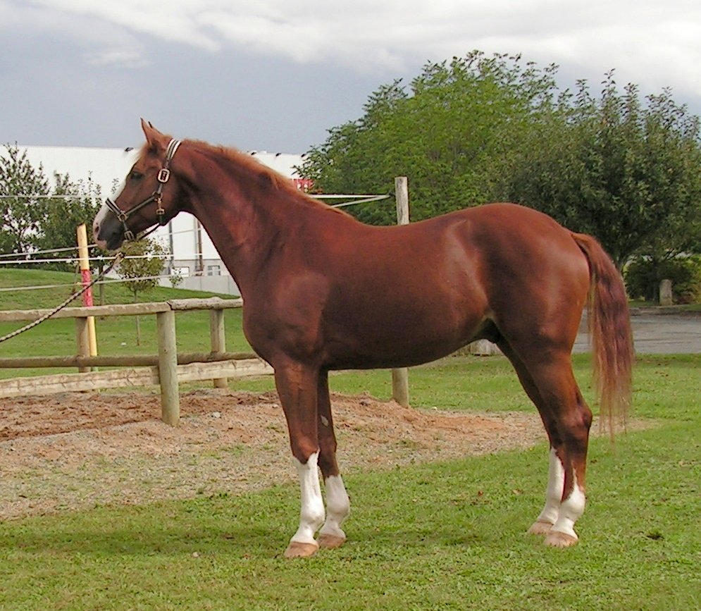
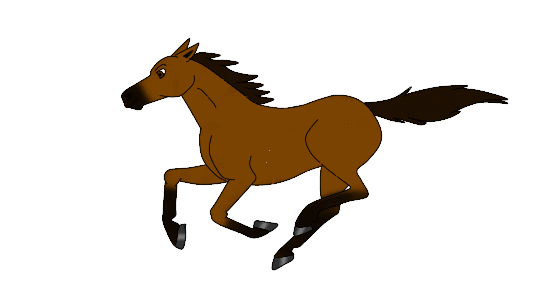
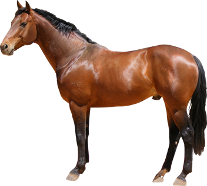

SVG ALL THE THINGS
==================




Why SVG?
--------

Choosing a web image

| [jpg](img/horse.jpg) | [gif](img/horse.gif) | [png](img/horse.png) | [svg](img/horse.svg) |
|-----|-----|-----|-----|
|  |  |  |  |
| Many colors | Animation | Transparency | Resolution Independence |

SVG also has animation and transparency but it's not good for photographs.

**Why do we care about different resolutions?**  
retina screens, mobile phones, print, zoom

**SVG vs Icon Fonts**  
http://css-tricks.com/icon-fonts-vs-svg/  
http://ianfeather.co.uk/ten-reasons-we-switched-from-an-icon-font-to-svg/  


What is SVG?
------------

Stands for Scalable Vector Graphics. 
It is an XML file that can be edited in any text editor.  
Replaces PGML and VML as the standard vector graphic for the web.  
SVG 1.1 Second Edition is the current standard; SVG 2 is under development.  

Specs - [www.w3.org/TR/SVG/](http://www.w3.org/TR/SVG/)

Feature Sets:

* [Paths](http://www.w3.org/TR/SVG/paths.html)
* [Shapes](http://www.w3.org/TR/SVG/shapes.html)
* [Text](http://www.w3.org/TR/SVG/text.html)
* [Painting](http://www.w3.org/TR/SVG/painting.html)
* [Color](http://www.w3.org/TR/SVG/color.html)
* [Gradients and Patterns](http://www.w3.org/TR/SVG/pservers.html)
* [Masking](http://www.w3.org/TR/SVG/masking.html)
* [Filters](http://www.w3.org/TR/SVG/filters.html)
* [Interactivity](http://www.w3.org/TR/SVG/interact.html)
* [Linking](http://www.w3.org/TR/SVG/linking.html)
* [Scripting](http://www.w3.org/TR/SVG/script.html)
* [Animation](http://www.w3.org/TR/SVG/animate.html)
* [Fonts](http://www.w3.org/TR/SVG/fonts.html)
* [Metadata](http://www.w3.org/TR/SVG/metadata.html)


### DTD (doctype)

[SVG doctype declarations are optional](http://www.w3.org/QA/2002/04/valid-dtd-list.html).

    Beyond the specificities of (X)HTML processing, Doctype declarations in XML languages are only useful to declare named entities and to facilitate the validation of documents based on DTDs. This means that in many XML languages, doctype declarations are not necessarily useful.

### Organizational Elements
`<g>`,`<use>`,`<defs>`,`<symbol>`

### Paths

"the <path> element is the most powerful element in the SVG library of basic shapes" - [MDN](https://developer.mozilla.org/en-US/docs/Web/SVG/Tutorial/Paths)

Line commands: (uppercase is absolute and lowercase is relative)

* 'M' or 'm': move to (x, y)
* 'L' or 'l': line to (x, y)
* 'H' or 'h': horizontal line (x)
* 'V' or 'v': vertical line (y)
* 'Z' or 'z': close path
* 'C' or 'c': cubic bezier curve (x1, y1, x2, y2, x, y)
* 'S' or 's': cubic bezier curver shortcut (x2, y2, x, y)
* 'Q' or 'q': quadratic bezier curve (x1, y1, x, y)
* 'T' or 't': quadratic bezier curve shortcut (x, y)
* 'A' or 'a': arc (rx, ry, x-axis-ration, large-arc-flag, sweep-flag, x y)

For the sake of brevity in paths, superfluous white space and separators can be removed as well as subsequent commands if the command is the same.

    M 100 100 L 200 200  
    M100 100L200 200

    M 100 200 L 200 100 L -100 -200  
    M 100 200 L 200 100 -100 -200


### Coordinate System

[The viewport, viewBox, & preserveAspectRatio](http://sarasoueidan.com/blog/svg-coordinate-systems/)

`viewBox`  
Attribute that sets the size of the canvas that all the coordinates inside the SVG use.

`preserveAspectRatio`  
Attribute that determines the relationship between the viewBox and viewport. Important for maintaining aspect ratio in scaling.

### Basic Shapes
```svg
<!--    rectangle    -->
<rect x="0" y="3" width="32" height="5" />

<!-- rounded corners -->
<rect x="0" y="3" width="32" height="5" rx="3" ry="3" />

<!--     circle      -->
<circle cx="50" cy="50" r="100" />

<!--    ellipse      -->
<ellipse cx="50" cy="50" rx="30" ry="20" />

<!--      line       -->
<line x1="10" y1="5" x2="20" y2="15" />

<!--    polyline     -->
<polyline points="10,20 10,30 15,30" />

<!--    polygon      -->
<polygon points="10,20 10,30 15,30" />
```


Using SVG
---------

Examples from [CSS-Tricks](http://css-tricks.com/using-svg/) and [Sitepoint](http://www.sitepoint.com/add-svg-to-web-page/).

Image tag
```html

```

Object tag
```html
<object type="image/svg+xml" data="image.svg"></object>
```

Iframe
```html
<iframe src="image.svg"></iframe>
```

Inline Use
```html
<svg><use xlink:href="image.svg#imageId"></use></svg>
```

CSS Background
```css
div {
    background: url('image.svg');
}
```

[Test Embed](http://cuth.github.io/svg-allthethings/test-embed.html)


### [Styling](http://www.w3.org/TR/SVG/styling.html)

**Common attributes**  
fill, stroke, transform  
currentColor  
CSS hooks on inline  


### Animating

multiple techniqes, javascript libraries/frameworks, built in animation, tricks


Sprites
-------

Sprites are used to lower the amount of requests made to the server. With PNGs this was done by flattening all the images on to one image and clipping the image to only show the portion that you wanted. This is still possible with SVG but there are better ways to do this.

Sprite svg using defs or symbol

Sprite using data-uri embeded in CSS

### Limitations
styling
svg4everybody

### Tooling

Grunticon, iconizer, npm/gulp/grunt  
https://github.com/Wenqer/gulp-base64  
https://github.com/akoenig/gulp-imacss  


Browser Support
---------------

Can I use, SVG, inline svg, svg animations

### Testing for support
Modernizr

http://css-tricks.com/test-support-svg-img/


But Wait there's more
---------------------

http://css-tricks.com/mega-list-svg-information/